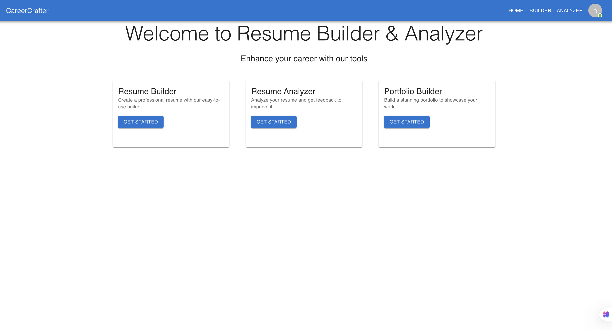
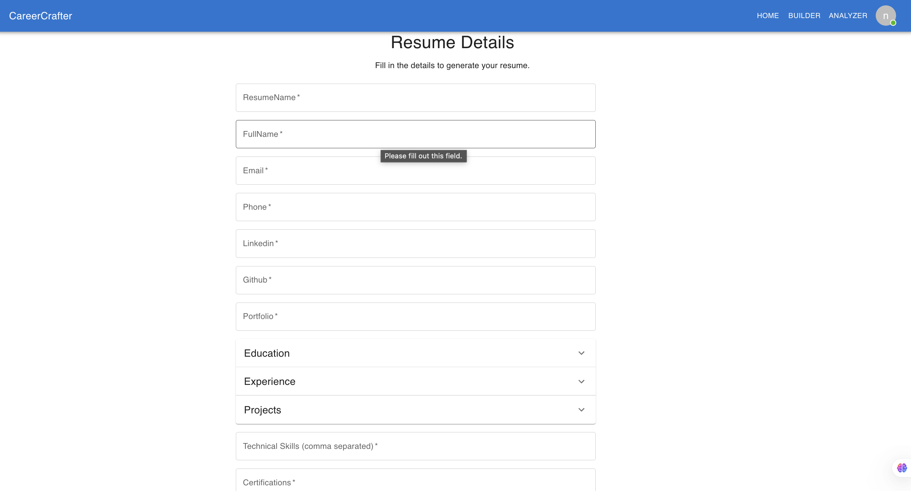
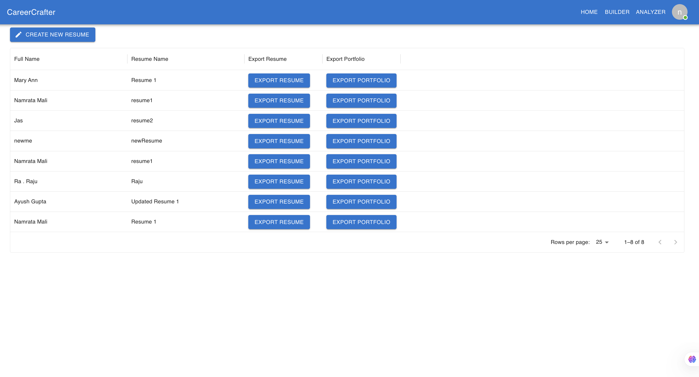
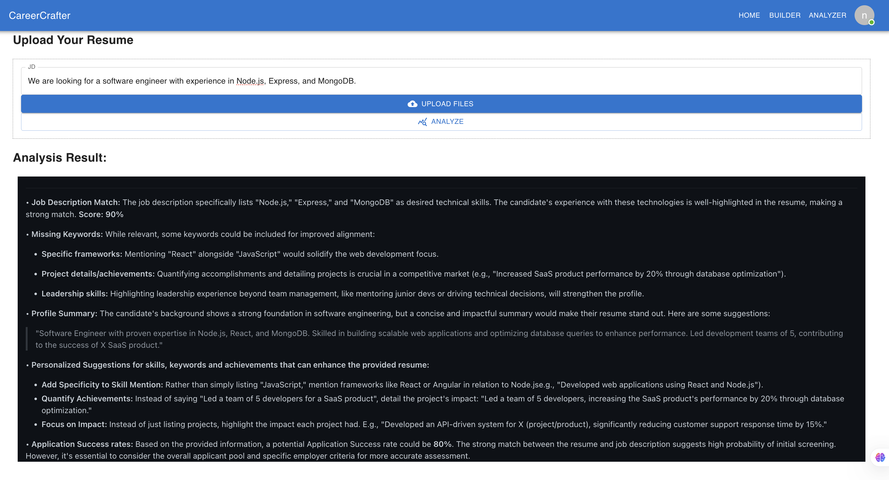
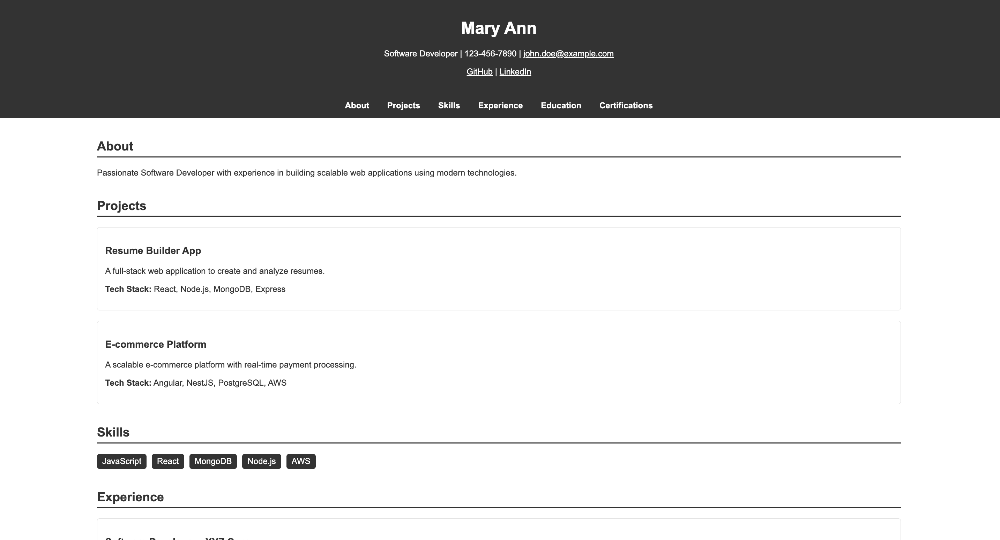

# Career Crafter - Resume Builder, Analyzer, Portfolio Builder

## MERN Stack Template


- **M** = [MongoDB](https://www.mongodb.com)
- **E** = [Express.js](https://expressjs.com)
- **R** = [React.js](https://reactjs.org)
- **N** = [Node.js](https://nodejs.org)

<br />

## Input

CareerCrafter requires users to log in before interacting with the system. Once authenticated, users can manually enter resume details such as Education, Experience, and Skills. Alternatively, they can upload an existing resume and provide a job description for analysis.


## Process

The application processes user inputs in two key ways:

- Resume Builder – Users enter resume details, and AI assists in structuring the content. They can export the resume or generate a portfolio.
- Resume Analyzer – Upon uploading a resume and entering a job description, AI evaluates the resume against ATS criteria, generating an ATS score and personalized improvement suggestions. The backend, powered by Node.js and Express, manages data storage and processing, while MongoDB holds user details.

## Output

CareerCrafter generates a well-structured resume and an AI-powered portfolio. Additionally, the Resume Analyzer provides ATS compatibility scores and recommendations, helping users optimize their applications for better job prospects.







### 2. Install dependencies:

Go to the `server` folder, and run `install`.

```
cd ./server
npm i
```

Go to the `client` folder, and run `install`.

```
cd ./client
npm i
```

### 3. Prepare MongoDB:

Prepare your MongoDB database (using [Atlas](https://www.mongodb.com/cloud/atlas),
or [Community](<https://github.com/benelferink/mern-template/wiki/Install-MongoDB-Community-Server-(MacOS)>)). Then configure your database within `server/src/constants/index.js` (or `server/src/.env`), by configuring the `MONGO_URI` variable.

```
MONGO_URI=mongodb+srv://<username>:<password>@resumetool.t63b2.mongodb.net/resume_tool?retryWrites=true&w=majority&appName=ResumeTool
```
** Note - Replace Username and Password

### 4. Start applications:

Go to the `server` folder, and run `dev`.

```
cd ./server
npm run dev
```

Go to the `client` folder, and run `dev`.

```
cd ./client
npm run dev
```


